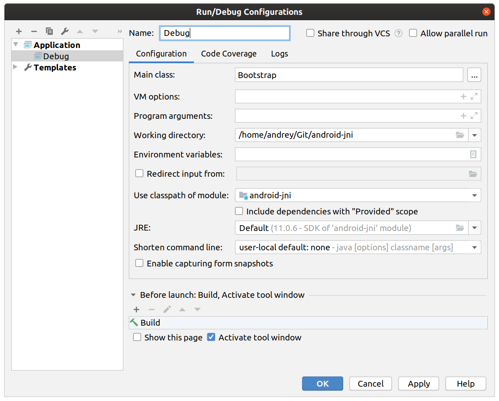

##Get signatures
javac is the primary Java compiler included in the Java Development Kit

### Generate header files
```
javac -h . com/saorsa/android/jni/java/JniSamples.java
``` 
### Build c++

Include dir is something intimate and personal. (; 

**/usr/lib/jvm/java-11-openjdk-amd64/include**
```
mv com_saorsa_android_jni_java_JniSamples.h shared-lib/
mv SampleCLib.c
```
####Produce out file

```
gcc -I "/usr/lib/jvm/java-11-openjdk-amd64/include/linux/" -I "/usr/lib/jvm/java-11-openjdk-amd64/include/" -I "`pwd`" -c SampleCLib.c
```

#####Compile shared library
```
gcc -shared -o SampleCLib.so SampleCLib.o
```
####Copy the shared library in a "system" known location
`cp SampleCLib.so /usr/java/packages/lib`
##Create debug configuration


